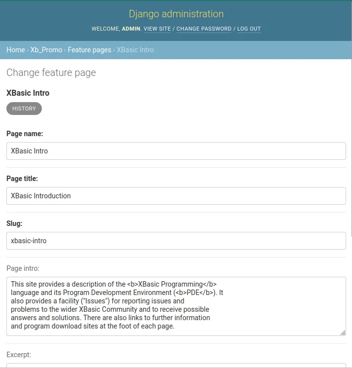
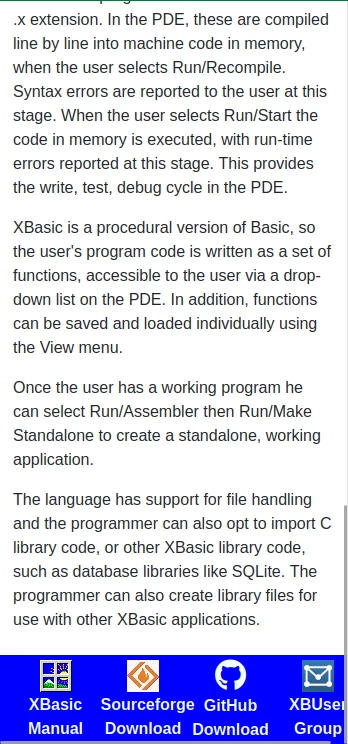
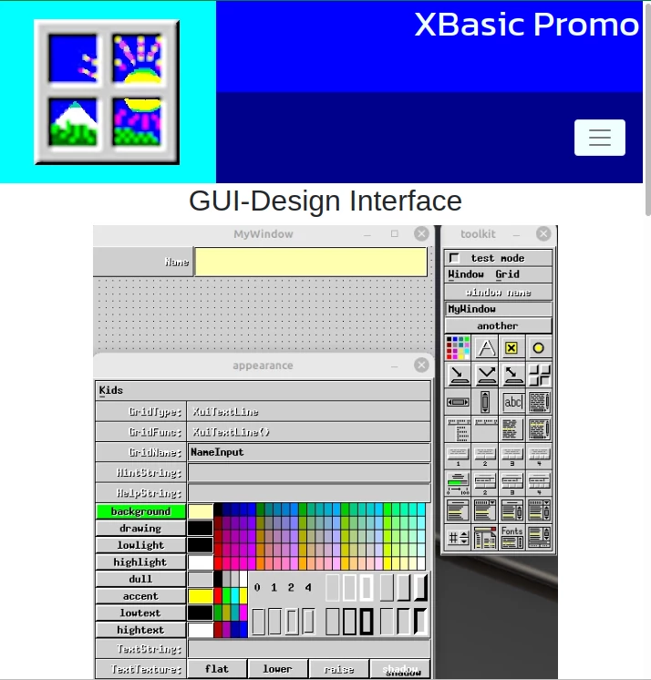
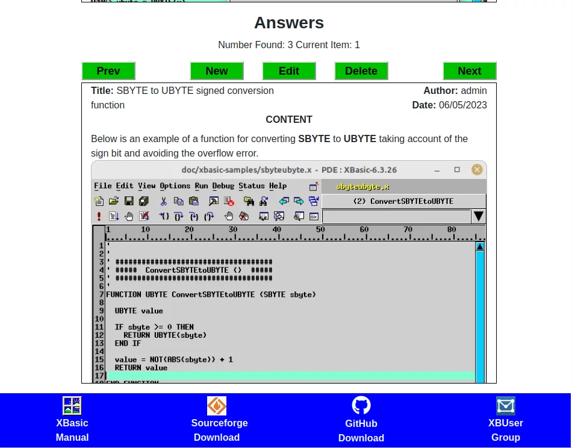

# Media Tests

Screen Sizes (based on Bootstrap)

350

540

720

960

1140

## Registration

Login:

Login 350

Login 540

Login 720

Login 960

Login 1140

Register:

Register 350

Register 540

Register 720

Register 960

Register 1140

## Admin

### Admin Main Page

Admin Main Page - 350

Admin Main Page - 540

Admin Main Page - 720

Admin Main Page - 960

Admin Main Page - 1140

### Admin Record List Page

Admin Record List 350

Admin Record List 540

Admin Record List 720

Admin Record List 960

Admin Record List 1140

### Admin Record Edit Page

Admin Edit Record - 350

Admin Edit Record - 540

Admin Edit Record - 720

Admin Edit Record - 960

Admin Edit Record - 1140

## XBasic Main Site

### Introductory Page

Introductory Page - 350

Introductory Page - 540

Introductory Page - 720

Introductory Page - 960

Introductory Page - 1140

### Feature Page Sample

Feature Page - 350

Feature Page - 540

Feature Page - 720

Feature Page - 960

Feature Page - 1140

### Issues Page

Issues 350

Issues 540

Issues 720

Issues 960

Issues 1140

### Edit/Add Issue

Edit Issue - 350

Edit Issue - 540

Edit Issue - 720

Edit Issue - 960

Edit Issue - 1140

### Edit/Add Answer

Edit Answer - 350

Edit Answer - 540

Edit Answer - 720

Edit Answer - 960

Edit Answer - 1140

