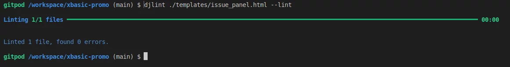

# xbasic-promo

## Introduction

This site provides the source and documentation for the XBasic-Promo website that
provides an introduction to the programming language and Program 
Development Environment (PDE) XBasic and an issue/problem reporting
reporting page for additional user support.

## Target Audience

The website is intended for programmers, both novice and established
to allow them access to the information required to make a decision
on choosing the XBasic programming language.

Additionally, the site provides for existing users to discuss issues
arising from their work.

- Main Page

- Issues

- Responsiveness

## Features

- Articles

The site provides informative pages about the XBasic programming language and the PDE, which can be modified on demand by the owner/administrator via the /admin/ page.

- Supporting Documentation

These notes are well supported by further documentation available via links on the footer. This also provides links to the user group and the download sites.

- Issues and Answers

The issues page allows a logged in user to add issues and answers to issues arising in the course of the work of existing XBasic users. It also provides for the owner/administrator to delete issues that are out of date or inappropriate. Issues and answers authored by the user, can be edited by the user.

Issues can be searched for by keywords and/or by clicking through with the Prev and Next buttons

- Issues

- Answers

## Development Methodology

Following from the UXD approach to design, the requirements are
established as a set of user stories and maintained as a list
in the Github issues set-up for project management.

Although the development approach is basically a Waterfall approach in the
sense that most of the design is done in advance, 
it uses the Agile approach, in terms of staging of work in order of priority, 
so that the project has flexible scope rather than trying to skip the deadlines for a 
completed work. 

The initial analysis has been conducted in [Project Analysis](/doc/project-analysis.txt).
High-level time recording and estimating is also maintained in this file, and this is
also used to record the user stories in detail.

Project Requirement items are listed in the project plan on GitHub 
xbasic-promo. [Project Planner](https://github.com/users/RobWar-code/projects/4)

Tasks in relation to general project work are recorded in
[Work Log](/doc/work-log.txt)

## Data Models

### Features Pages

Feature Page

This allows for the page title and page introductory section which may contain a background image, 
if required.

| Field			| Type             | Other Aspects                         |
| ------------- | ---------------- | ------------------------------------- |
| page_name		| Char(32)         | unique                                |
| page_title	| Char(80)		   |                                       |
| slug          | SlugField(40)	   | from page title                       |
| page_intro    | TextField        | Maybe null                            |
| excerpt       | Char(80)         | Maybe null, excerpt from page intro   |
| intro_image	| CloudinaryImage  |                                       |

### Feature Sections

This data is for the feature sections, allowing the administrator to modify
page content for reasons such as information updates or to cover some topic
in more detail.

Feature Sections are linked to Feature Pages in a one to many relationship.

Feature Section

| Field             | Type             | Other Aspects              |
| ----------------- | ---------------- | -------------------------- |
| title             | Char(80)         | unique                     |
| section_number	| Integer		   | unique - for ordering      |
| feature_page	    | ForeignKey       | from feature_page          |
| article			| TextField        |                            |
| excerpt			| Char(80) 		   | Text excerpt from article  |
| feature_image     | CloudinaryImage  |  can be null               |

### Issues And Answers

Issues are raised by users about problems etc. with XBasic usage. This table
provides for a description of the issue with a screenshot if required. A keywords
field is provided to make word searches more accurate. A priority field is also
provided, to allow the administrator to bring items further up the list, above
the date order.

Issue

| Field             | Type             | Other Aspects                                           |
| ----------------- | ---------------- | --------------------------------------------------------|
| title             | Char(80)         | unique                                                  |
| slug              | Slug(80)         | unique, auto-update                                     |
| author            | One To Many      | Auto insert for the logged-in user                      |
| date_submitted    | Date/Time        | Auto insert at record creation                          |
| priority          | Integer          | default is 3 can be set to lower for display ordering   |
| description       | Char(240)        |                                                         |
| keywords          | Char(240)        | For searching                                           |
| content           | TextField        |                                                         |
| screenshot_img    | Cloudinary Image | default is 'placeholder', can be blank                  |
| search_vector     | SearchVector     | For keyword searches on title, description and keywords |

Answers are raised in response to issues in a one to many relationship, they may or may not be 
accompanied by a screenshot.

Answer

| Field             | Type              | Other Aspects                                      |
| ----------------- | ----------------- | -------------------------------------------------- |
| title             | Char(80)          | Unique                                             |
| author            | One to many       | Auto set for logged-in user                        |
| date_submitted    | Date/Time         | Auto set when record created                       |
| date_modified     | Date/Time         | Auto set when record edited                        |
| priority          | Integer           | For ordering on display, default is 3, 1 is higher |
| related_issue     | One to many       |                                                    |
| content           | TextField         |                                                    |
| screenshot_img    | Cloudinary Field  | Default is 'placeholder', can be blank             |

## Platforms Used

The code and documentation is maintained on GitHub with updates
deployed via the Gitpod IDE.

The application runs on the python server engine provided by Heroku

The database is retained on ElephantSQL as postgresql database

Image files are retained on and accessible from the Cloudinary site

## Initial Set-up Procedures

This section provides the steps necessary to set-up the site

### Setting-up The IDE project (gitpod)

We are using cloudinary to store images, as image files on Heroku are ephemeral.

Note that the settings for settings.py are already established, so if recreating
this or similar based on this site, all that is necessary is to install the python
libraries and to do the set-ups on Heroku, Cloudinary and ElephantSQL.

On gitpod we 

* install django
* create a django project and app
* set the project to use postgresql and cloudinary
* deploy the project to django

Install django and cloudinary

* `pip3 install 'django<4' gunicorn`
* `pip3 install dj_database_url==0.5.0 psycopg2`
* `pip3 install dj3-cloudinary-storage`

Create the requirements.txt file
* `pip3 freeze --local > requirements.txt`

Start Project
* `django-admin startproject xbasic-promo` 

To create an app for the project
* `python3 manage.py startapp xb-promo`

Add the app to settings.py in the project folder as:

        INSTALLED_APPS = [
            ...,
            'blog'

Migrate the changes to the database
* `python3 manage.py migrate`

Check that the install worked
* `python3 manage.py runserver`

### Setting-up the Heroku App and the ElephantSQL Database

* Login to Heroku
* Click on New for a new app
* Click create new app
* Enter a name for app - xbasic-promo
* Select europe as the area

* Login to ElephantSQL
* Create a new instance (tiny turtle) - xbasic-promo-items
* Set the nearest data centre
* Review
* Confirm
* Copy the database url

* create an env.py file
* insert the database link into it
		import os

		os.environ["DATABASE_URL"] = "copied url link"
		os.environ["SECRET_KEY"] = "my_magic_secret_key"
		os.environ.setdefault('DEBUG', 'True')

* in settings.py
		import os
		import dj_database_url

		if os.path.isfile("env.py"):
			import env

		DEBUG = os.environ.get('DEBUG', False)

		SECRET_KEY = os.environ.get['SECRET_KEY']

* Comment out the existing database setting, insert
		DATABASES = {
			'default': dj_database.url.parse(os.environ.get('DATABASE_URL'))
		}

* Finally establish these settings using
* `python3 manage.py migrate`

You can check that the link to the ElephantSQL database is established by using
the BROWSER option on the site for the relevant database. admin tables will have
been established.

* Add the config vars to the heroku site for the application
		DATABASE_URL    my_database_url
		SECRET_KEY      my_secret_key
		PORT			8000

### Setting the Link to Cloudinary
* Create an account on cloudinary
* Go to the dashboard - copy the API environment variable
* In env.py

		os.environ["CLOUDINARY_URL"] = "api from cloudinary"
		
(remove CLOUDINARY= from the start of the url)
* Also paste this into heroku in config vars

		CLOUDINARY_URL
		DISABLE_COLLECTSTATIC		1

* To the settings.py file in INSTALLED_APPS above django.contrib.staticfiles, add

		'cloudinary_storage',

* And above the app name ('xb-promo')

		'cloudinary'

* To set the file access for cloudinary add the following lines to settings.py
below STATIC_URL

		STATICFILES_STORAGE = 'cloudinary_storage.storage.StaticHashedCloudinaryStorage'
		STATICFILES_DIRS = [os.path.join(BASE_DIR, 'static')]
		STATIC_ROOT = os.path.join(BASE_DIR, 'staticfiles')

* Below this in settings.py

		MEDIA_URL = '/media/'
		DEFAULT_FILE_STORAGE = 'cloudinary_storage.storage.MediaCloudinaryStorage'

### Setting the Templates Directory

Like the other notes for settings.py this phase already completed in settings.py

* In settings.py below BASE_DIR

		TEMPLATES_DIR = os.path.join(BASE_DIR, 'templates')

* Change the DIRS entry of the TEMPLATES setting

		'DIRS': [TEMPLATES_DIR],

### Completing the Heroku Setup
	
Note that the following steps are already completed on the github site

* In settings.py set ALLOWED_HOSTS

		ALLOWED_HOSTS = ['my-django-blog-project.herokuapp.com', 'localhost']

* in gitpod, create the following directories on the top level:

		media
		static
		templates

* Create the Procfile:

		web: gunicorn codestar.wsgi

Save the current status

* Push the changes to the github repository

		git add .
		git commit -m "Add initial deployment"
		git push

### Deployment

On the heroku site for the application

* Click deploy
* Choose Github
* Select the repository
* Connect
* Deploy Branch

* Click View to check the page

If this fails to load as far as the python code page, you can check
the logs by logging into the heroku CLI on gitpod
		heroku login -i

To get the authentication password for this, go to your heroku site
and click the user icon on the top right.
* Select Account Settings
* Scroll to API Key
* Click reveal and then copy it
* Paste it into the CLI login prompt for password

To get the logs:
		heroku logs --app=my_heroku_app_name --tail
	
## Systems Tests

Systems Tests are in the file [SYSTEM_TESTS.md](./SYSTEM_TESTS.md)

## Media Tests

Media Tests are in the file [MEDIA_TESTS.md](./MEDIA_TESTS.md)

## Lighthouse Tests

Main Page

Performance is likely below par because of the additional Cloudinary web request load for the images

Issues Page

The performance may well be pulled down by the additional Cloudinary web request load for the images

Accessibility is slightly down because the logo is a link for the home page and does not have a text name. 
Since the home page also has a menu bar link, this is not necessary. There is also an issue raised about a duplicated
id for the Confirmation Modal, this may be due to the aria-labelledby element containing the required element id, 
rather than the other way around.

The Best Practices score is down because the form cloudinary addresses for the cloudinary site are http:
instead of https: This is an issue with the Cloudinary python library.

## Code Quality Tests

### Python Quality
Using https://pep8ci.herokuapp.com

xb-promo/admin.py

xb-promo/forms.py

xb-promo/models.py

xbasic-promo/settings.py

xb-promo/views.py

### CSS Code
Using: https://jigsaw.w3.org/css-validator/#validate_by_input

/static/css/style.css

### HTML Templates
Using djlint (pip install djlint), djlint file-path --lint

templates directory

answer_panel

Note that the width for the image is set as 100% in the css file

base

The duplicate attribute is a repeated href used also for the title logo

edit_answer

The apparently orphan form tag is a part of a template
conditional if .. else

edit_issue

The apparently orphan form tag is a part of a template
conditional if .. else

index

issue_control

issue_panel

issues

## Errors / Bug Reports

### Due:

Problem: Admin Pages - Summernote editor fails to work once 
used elsewhere in site - needs investigation

Status: Ongoing

Priority: Medium

Temp fix - just use text editing on the content fields

Could be due to a dual reference to the summernote library in different modules

--------------------------
Problem: Admin Pages, Add Issue - Search Vector field not updated

Status: Ongoing

Priority: Low

When the entry is updated the search vector field IS updated.

### Fixed

Problem: Admin Pages, Model Data Editing:

Status: Fixed

The summernote presentation of the textfields had ceased to work after summernote
was used on the issues and answers pages. This may be a library usage problem.

Solution:

Withdraw the summernote presentation on the admin pages.

----------------------

Problem: Image not saved with add/edit issue and add/edit answer

Status: Fixed

Priority: High

The problem was caused by the cloudinary image field not being updated/connected
to the site using the ModelForm. This has to be done explicitly.

            # Upload the file to Cloudinary
            uploaded_file = cloudinary.uploader.\
                upload(request.FILES['screenshot_img'])

            # Assign the Cloudinary URL to the `image` field of the `Issue`
            # model instance
            instance.screenshot_img = uploaded_file['url']

-----------------
Problem: Add/Edit Issue - The submit button is too small for the text on small screens

Status: Fixed

Priority: High

Submit button div set to col-4 col-lg-2
------------------
Problem: Edit Issue Page - No error message reported to user when duplicate title field
submitted

Status: Fixed

It was necessary to detect the form error explicitly in the invalid form section
of the IssueEdit view:

message_text = issue_form.errors.get('title', None)

messages.warning(request, message_text)
 
------------------

Problem: Add Answer/Edit Answer - Image not uploaded

Status: Fixed

Priority: high

This is the same as the problem as it appeared in the issue form.
In this case solved by adding 

enctype="multipart/form-data"

to the template.
---------------------
Problem: Add Answer, When Title Duplicated - no message

Status: Fixed

Priority: High

Message displayed as warning
-------------------

Problem: Admin Pages, Delete Feature Section - Title not displayed on confirmation

Status: Fixed

Priority: Medium

The model FeatureSection required the function

def __str__(self):
    return self.title

----------------------------

Problem: Edit Answer - Sometimes comes brings-up the wrong record.

Status: Done

Priority: High

Solution: This may well be due to the fact that the list of records produced
depends on a search, rather than using the issue ID. Therefore the fix is
to re-obtain the issue number within the default list of all issues use that
as the issue number (within the ordered list).

---------------------

## Browser Tests

See: [Browser Tests](./BROWSER_TESTS.md)

