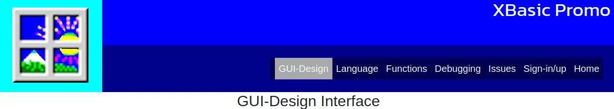
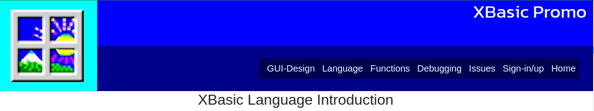
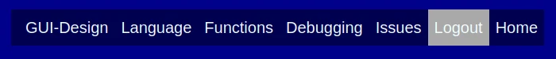
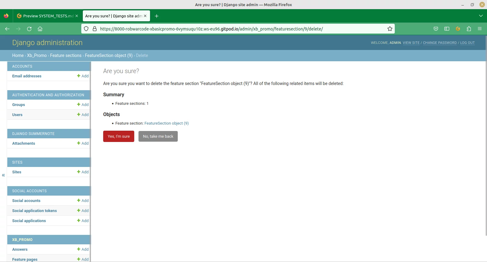
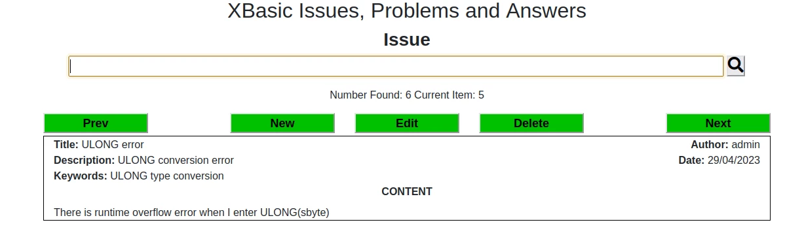
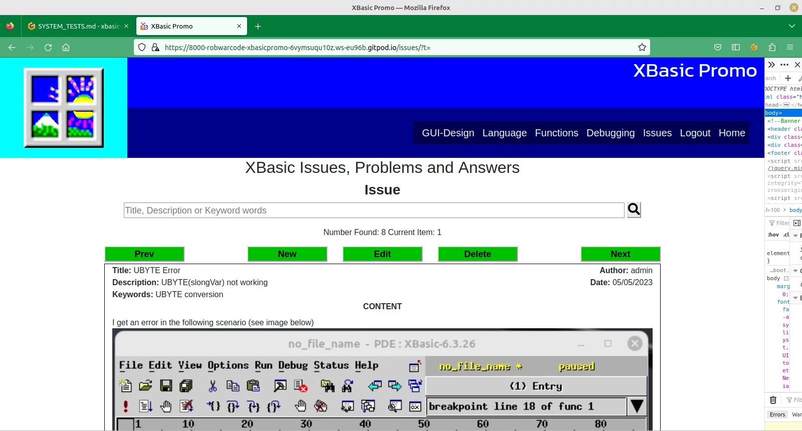

# XBASIC PROMO SYSTEMS TESTS

## Introduction

For more details on these tests please consult [Project Analysis](/doc/project-analysis.txt)

## Header

### Acceptance Criteria

The XBasic brand and a logo should appear at the top of each page

A menu set of page links should be presented toward the top of the page

On small screens the menu should appear as a drop-down menu

Each of the menu items is highlighted when hovered on and the links work:

Home

Home Link

GUI-Design

GUI-Design Link

Language

Language Link

Functions

Functions Link

Debugging

Debugging Link

Issues

Issues Link

Sign-in/up

Sign-in/up Link

Logout

Logout Link

## Footer

### Acceptance Criteria

There is a link in the footer to the XBasic manual

Links to the sourceforge and github sites in the footer with text

Links to the groups.io and sourceforge sites

### Link Tests

XBasic Manual

Sourceforge Download

GitHub Download

Groups.io

## User Adminitration, Registration, General

### Acceptance Criteria

There should be pages for Login, Sign-up and Logout

Registration details include a username

Register

Login

Logout

A message should be displayed after logout/login and register

The user should be returned to the home page after each action

The menu item for Logout should only be visible if the the user is logged-in

The menu item for Login/Sign-up should only be visible if the user is NOT logged-in

Register

Login

Logout

### Data Tests

Registration:

omit username

Focus returned to username with focus message

omit password

Focus returned to password with focus message

poor password

username already exists

Login:

omit username

Focus set on username and option to view saved logins presented

invalid username

omit password

Focus set on password, message displayed

invalid password

## Administration Editor

### Acceptance Criteria

Feature Pages:

Editing of the feature pages is provided by the site/admin/ url

There is provision for feature pages

The administrator can add feature pages

The administrator can edit feature pages

The administrator can include a feature page introduction with an image

Site page contents are updated according to the feature page record

The administrator can delete feature pages

Confirmation is required for feature page deletion

Feature Sections:

There is provision for feature sections

The administrator can add feature sections

The administrator can edit feature sections

Site page contents are updated according to changes to the feature sections

The administrator can delete feature sections

Confirmation is required for section deletion

As an administrator I can edit/add or delete Issues using the admin pages in order to 
ensure editorial standards

Issues:

Admin Pages Add Issue

Issues are updated accordingly on the Issues page of the website

Admin Pages Edit Issue

Admin Pages Delete Issue

Deletion requires confirmation

Answers:

As an administrator I can edit/add or delete Answers using the admin pages in order to 
ensure editorial standards

Acceptance criteria:

Admin Pages Add Answer

Answers are updated accordingly on the Issues page of the website

Admin Pages Edit Answer

Admin Pages Delete Answer

Deletion requires confirmation

#### Data Tests

Duplicate Title - Should be Unique in all cases:

Add Feature Page

Add Feature Section

Add Issue

Add Answer

### XBasic Intro Page

As a new or existing programmer I can read a brief desciption of the 
XBasic PDE and Language in order to get an overview.

Acceptance Criteria

There is an introductory panel describing the site

The opening page has a brief description of the XBasic system.

There is a screenshot of the PDE and console on the opening page

There is a screenshot example of some code which has been run

It should be clear what environments the language will operate in

There is a description of file handling capabilities

There is a description of database handling capabilities

There is a brief description of the GUI toolkit

### GUI Design

As an existing programmer I can refer to a description of the GUI toolkit in order to determine
whether XBasic is suitable for my requirements

Acceptance Criteria:

GUI toolkit description and screenshots on own page

### Language Features - Language page

As a user I can read a summary description of language features in order to gain more insight

Acceptance Criteria:

On a separate page there is a summary description of key language features

The description has associated screenshots

### Built-in Functions - Functions Page

As a user I can read about built-in functions in order to gain more insight into language features

Acceptance Criteria

On a separate page there is a summary description of built-in functions

### Debugging Features - Debugging Page

As a user I can read a description of debugging features in order to know about ease of coding

Acceptance Criteria:

On a separate page there is a summary description of debugging features

Debugging description is supported by screenshots

### Issue Pages

As a user, I can discuss/read about issues and problems with XBasic, in order to further 
	my understanding or help to resolve a problem

Acceptance Criteria:

Error and problem discussion page/database

By default, the issue page presents the most recent issue

Issues can be scrolled through in date or search rank order

The problem page has a search input field at the top

There are next and previous buttons on the reply area

The search is conducted by description, title or keywords

When no user is logged-in an options message is displayed

When a user's issue is displayed, the new and edit options are available

When another user's issue is displayed, only the new option is available

When the user is an administrator the New, Edit and Delete buttons are available

Add Issue:

As a user, I can raise an issue, in order to ask for help in resolving my problem/issue

Acceptance Criteria:

On the issues page there is an new issue button

When the user clicks on the new issue button a form area is presented, ready to enter text into 

When the new Issue button is clicked, the user is required to enter a title

When the user clicks the new Issue button, he is presented with a keywords field
along with the other fields.

The issue entry layout includes a feature to select an image using a file system browser

Images are recorded along with the issue description

The user is returned to the issues page after a submit, with the entry showing

A message appears at the top of the screen to indicate an issue added

Data Tests:

Title Left Blank

Focus is set on title field and hover message appears

Title Duplicated

Edit Issue:

As an Owner/Administrator I can edit issues so that they conform to standards

Acceptance Criteria

If the user is an owner/administrator an edit button appears on an issue

Clicking the edit button enables editing of the current issue

When the edit button is clicked a submit button appears in the issue area

The user is returned to the issue page with entry after an edit

A success message appears toward the top of the page

Data Tests

Image Deleted

Image Replaced

Title Blank

Focus set on title, hover message appears

Title Duplicated

Delete Issue

As an Owner/Administrator, I can delete an issue, in order to remove unnecessary or offensive issues

Acceptance Criteria

There should be a confirmation before the delete is executed

There should be a message after the delete

### Answers

Answer Edit Options Availability:

If user is super-user/owner/administrator

No Answers

Options: New

Otherwise
                    
Options: New, Edit, Delete

Else If general user

No Answers:

Options: New

If the user is the author:

Options: New, Edit

If the user is NOT the author:

Options: New

Else (NOT logged-in)

Options: None
                
Message to indicate how to add

Add Answer

As a logged-in user I can add a reply to an issue in order to inform other users and participate

Acceptance Criteria

There is a New button on the issues area, which raises an Answer entry form
on the issues page

The layout of the Answer form is very similar to the issue form

When the new answer is submitted, the user is returned to the issues page with
the issue and answer displayed

A message appears when the form is successfully submitted

Data Tests:
	
title blank

The focus is set on the title, with a hover message displayed

title duplicated

Edit Answer:

As an Administrator or the author I can edit answers so that they conform to standards

Acceptance Criteria:

If the user is an owner/administrator an edit button appears above the answer

Clicking the edit button enables editing of the current answer

When the submit button is clicked the user is returned to the issues page with the 
appropriate issue and answer displayed

When the record is added a message appears on the relevant issues page

Data Tests:

title blank

message appears in hover text with the focus on title

title duplicated

Delete Answers

As an Administrator I can delete answers in order to maintain standards

Acceptance Criteria:

Clicking the delete button on the answer form of the issues page causes
the confirm option to appear

Once the deletion has been confirmed the answer record is deleted

When an answer deletion is done a message appears at the top of the page

When an answer deletion is done the issue page displays the current issue

