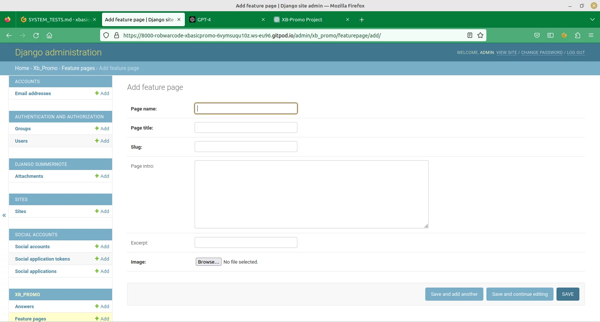

# XBASIC PROMO SYSTEMS TESTS

## Introduction

For more details on these tests please consult [Project Analysis](/doc/project-analysis.txt)

## Header

### Acceptance Criteria

The XBasic brand and a logo should appear at the top of each page

A menu set of page links should be presented toward the top of the page

On small screens the menu should appear as a drop-down menu

Each of the menu items is highlighted when hovered on and the links work:

Home

Home Link

GUI-Design

GUI-Design Link

Language

Language Link

Functions

Functions Link

Debugging

Debugging Link

Issues

Issues Link

Sign-in/up

Sign-in/up Link

Logout

Logout Link

## Footer

### Acceptance Criteria

There is a link in the footer to the XBasic manual

Links to the sourceforge and github sites in the footer with text

Links to the groups.io and sourceforge sites

### Link Tests

XBasic Manual

Sourceforge Download

GitHub Download

Groups.io

## User Adminitration, Registration, General

### Acceptance Criteria

There should be pages for Login, Sign-up and Logout

Registration details include a username

Register

Login

Logout

A message should be displayed after logout/login and register

The user should be returned to the home page after each action

The menu item for Logout should only be visible if the the user is logged-in

The menu item for Login/Sign-up should only be visible if the user is NOT logged-in

Register

Login

Logout

### Data Tests

Registration:

omit username

Focus returned to username with focus message

omit password

Focus returned to password with focus message

poor password

username already exists

Login:

omit username

Focus set on username and option to view saved logins presented

invalid username

omit password

Focus set on password, message displayed

invalid password

## Administration Editor

### Acceptance Criteria

Feature Pages:

Editing of the feature pages is provided by the site/admin/ url

There is provision for feature pages

The administrator can add feature pages

The administrator can edit feature pages

The administrator can include a feature page introduction with an image

Site page contents are updated according to the feature page record

The administrator can delete feature pages

Confirmation is required for feature page deletion

